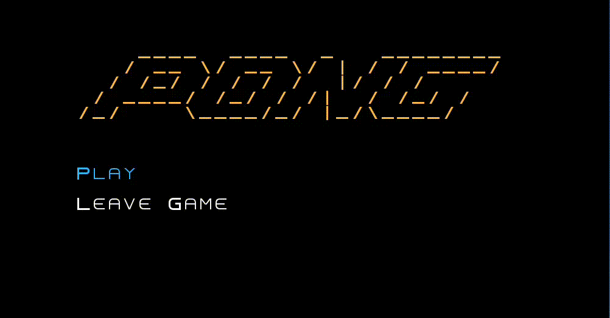
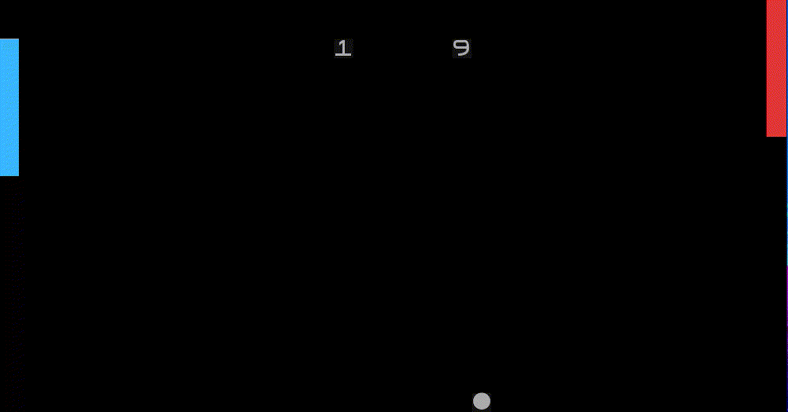
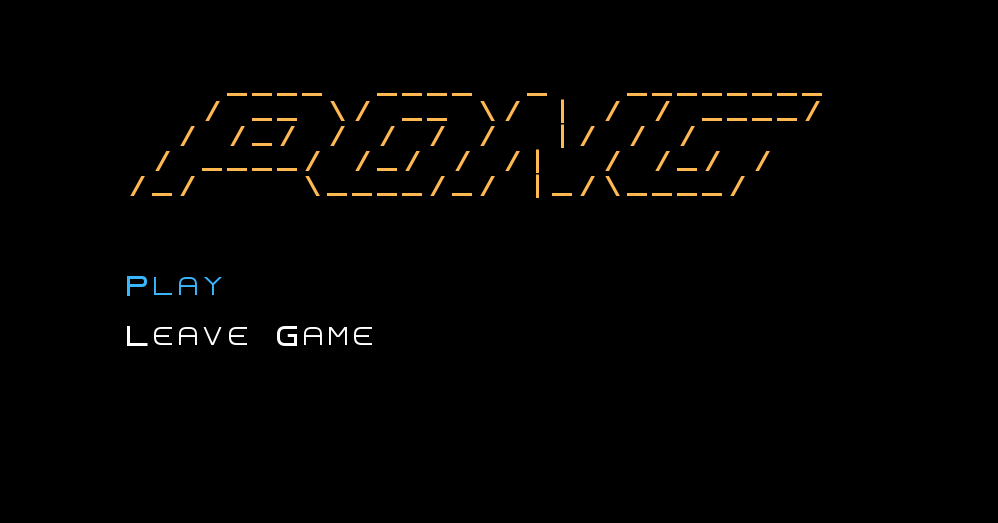
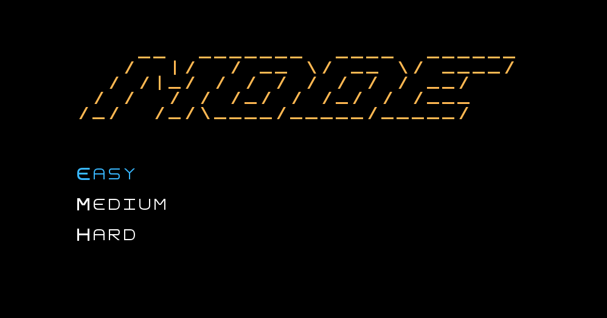
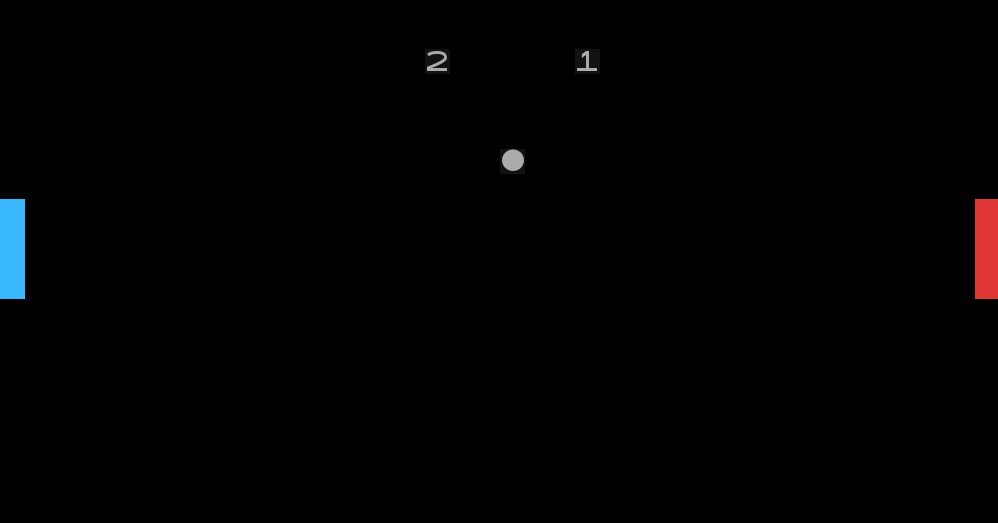
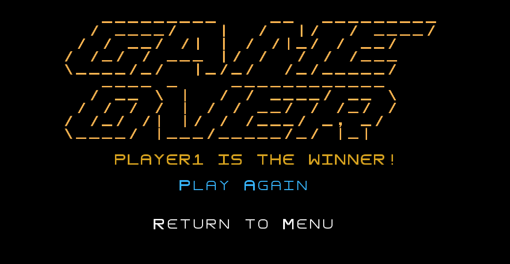

# LDTS_T14_G03 - PONG 

#### Project done in collaboration with:  
[Afonso Domingues](https://github.com/AfonsoDomingues17)  
[Tomás Marques](https://github.com/Torpedoooo)

## Grade: 17.4/20

## Description
For this project, our group decided to make a spin-off of the classic and revolutionary Pong, made by Atari in 1972.
We decided on this game because although it is simple, allowing us to focus on following good object-oriented design practices,
with close attention to the use of appropriate design patterns and complete testing, it also is different from previous projects and exercises we have done,
in the sense that we need to implement some features that were not formerly explored in our lectures, like the physics of the ball.

This project was developed by Afonso Domingues, David Gonçalves and Tomás Marques for LDTS 2023-24.

For a more detailed version of this description click [here](./docs/README.md).


## Controls
```W``` : Moves the left paddle up.  
```S``` : Moves the left paddle down.  
```↑``` : Moves the right paddle up.  
```↓``` : Moves the right paddle down.  
```Q``` : Returns to menu mid-game or in difficulty selection. 

## Animations

### Game Demo

<div style="text-align: center;"></div>
<div style="text-align: center;"><b><i>Gif 1. Demo of gameplay</i></b></div>

## Winning experience :)

<div style="text-align: center;"></div>
<div style="text-align: center;"><b><i>Gif 2. The winning moment</i></b></div>

## Screenshots

These screenshots showcase the overall appearance of our game and highlight its varied functionalities:


### MENUS

<br>
<br />

<div style="text-align: center;"></div>
<div style="text-align: center;"><b><i>Fig 1. The Main Menu</i></b></div>

<br>
<br />


<div style="text-align: center;"></div>
<div style="text-align: center;"><b><i>Fig 2. Choosing game difficulty (Mode Menu)</i></b></div>

<br>
<br />

<div style="text-align: center;"></div>
<div style="text-align: center;"><b><i>Fig 3. Mid-game screenshot (Game Menu)</i></b></div>

<br>
<br />

<div style="text-align: center;"></div>
<div style="text-align: center;"><b><i>Fig 4. Winning screen (Winner Menu)</i></b></div>

### Installing and running the project:

1 - Install a Java Development Kit (we only tested using version 17): [JDK 17](https://www.oracle.com/pt/java/technologies/downloads/#java17)

2 - Clone this repository
  
    git clone https://github.com/davidm-g/PONG-Game.git

3 - Navigate to the main directory
	
    cd PONG-Game

4 - Since this was done using gradle wrapper now you can run your new favourite Pong game!

    ./gradlew run

###  Instructions: [Project Description](/docs/instructions.pdf)

Made by David Gonçalves | davidmgoncalves.pt@gmail.com  
<div id="badge"> <a href="https://www.linkedin.com/in/davidm-g"/> &nbsp;