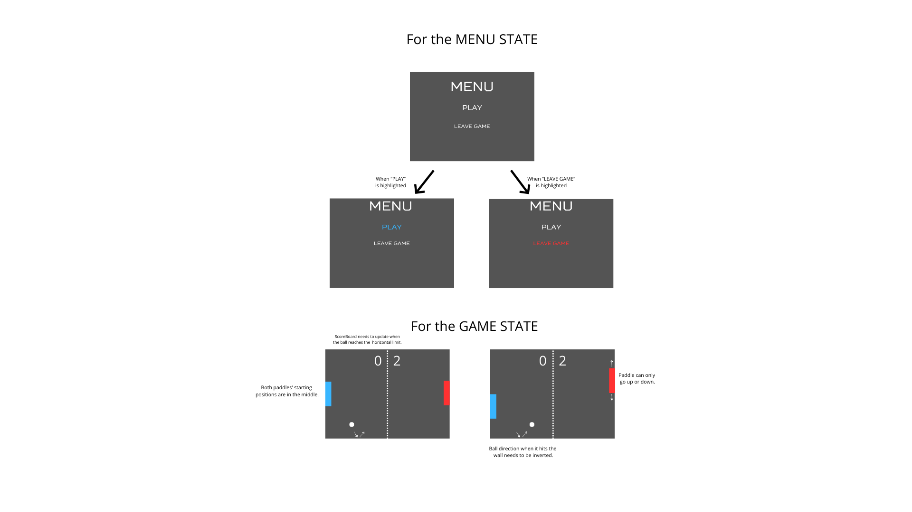
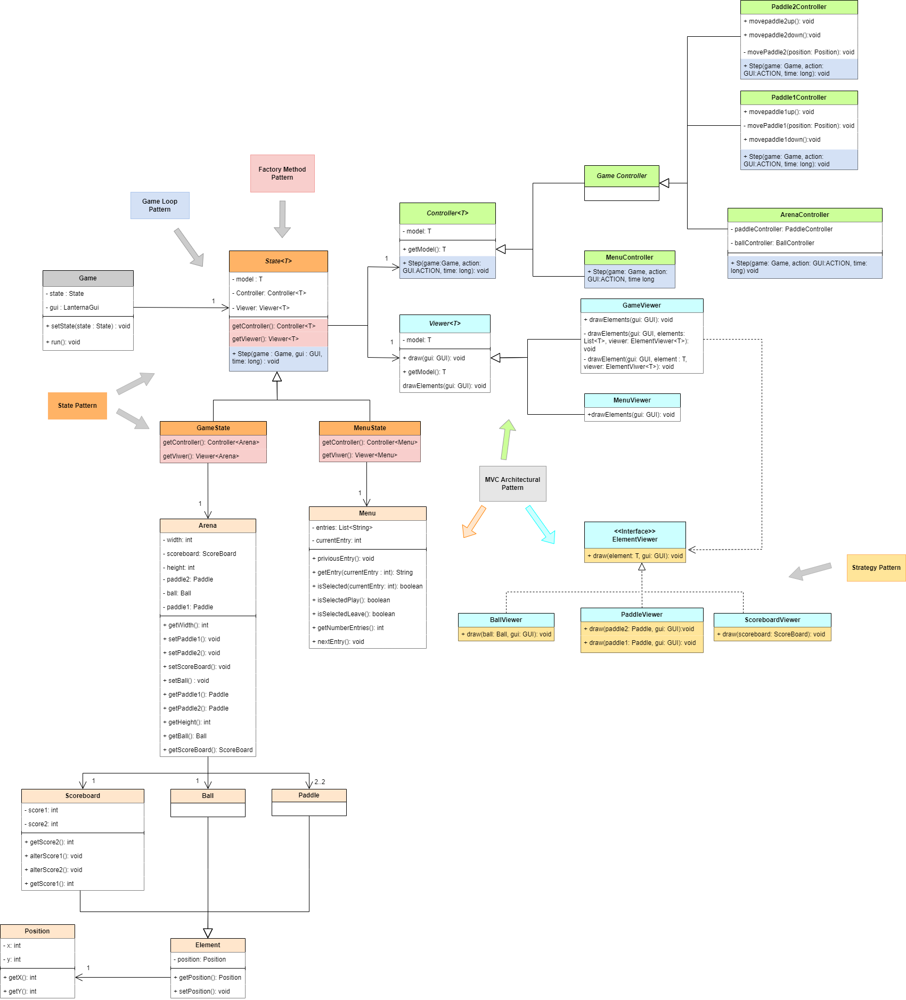

# Java Pong Game

## Description
For this project, our group decided to make a spin-off of the classic and revolutionary Pong, made by Atari in 1972.
We decided on this game because although it is simple, allowing us to focus on following good object oriented design practices,
with close attention to the use of appropriate design patterns and complete testing, it also is different from previous projects and exercises we have done,
in the sense that we need to implement some features that were not formerly explored in our lectures, like the physics of the ball.
## List Of Features
For this project we are aiming to use five Design Patterns:
### Game Loop Pattern
The game loop pattern is essentially a loop that repeats at a consistent rate, ensuring that the game progresses smoothly over time. For our work, this pattern will be implemented in the "State" class, and with each iteration the position of the paddles, ball, and potencially the score of the game will all be updated.  
### State Pattern
This pattern is set to be implemented for the Game and Menu states. Resorting to the State class, we will be able to change between the aforementioned Game and Menu states in run-time. Initially we start in the MenuState then, when we start a new game of pong, we switch to the GameState and when the game ends we go back to MenuState again, changing the State behavior each time.
### Factory Method Pattern
Because the State class wants the subclasses(GameState and MenuState) to specify the Controller and Viewer objects it creates, we will implement the Factory Method Pattern to make this happen.
### Model-View-Controller
In order to deal with the architectural style of the software, we need to resort to this architectural pattern as a means to develop our user interfaces in a way that divides our project in three parts:
  #### Model
The model only represents the data of the classes that will be displayed.
  #### View
The view displays in the screen the data that is given to us from the model, and also sends the user inputs to the Controller.
  #### Controller
The controller modifies the data from the Model based on the user inputs given by the View.
### Strategy Pattern
We needed to find a way to make the ElementViewer class have different behaviors, depending on the Element object to view. To sort this out, we are bound to implement the Strategy Pattern.

## Mockup

## UML Diagram

