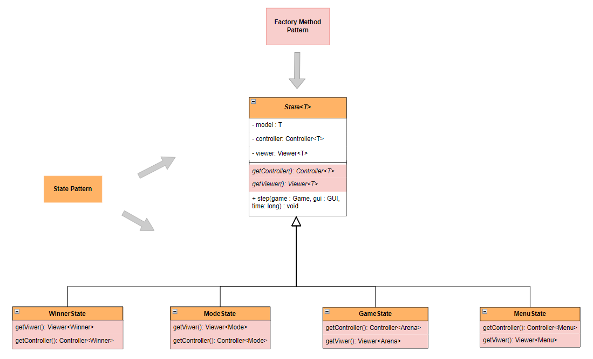
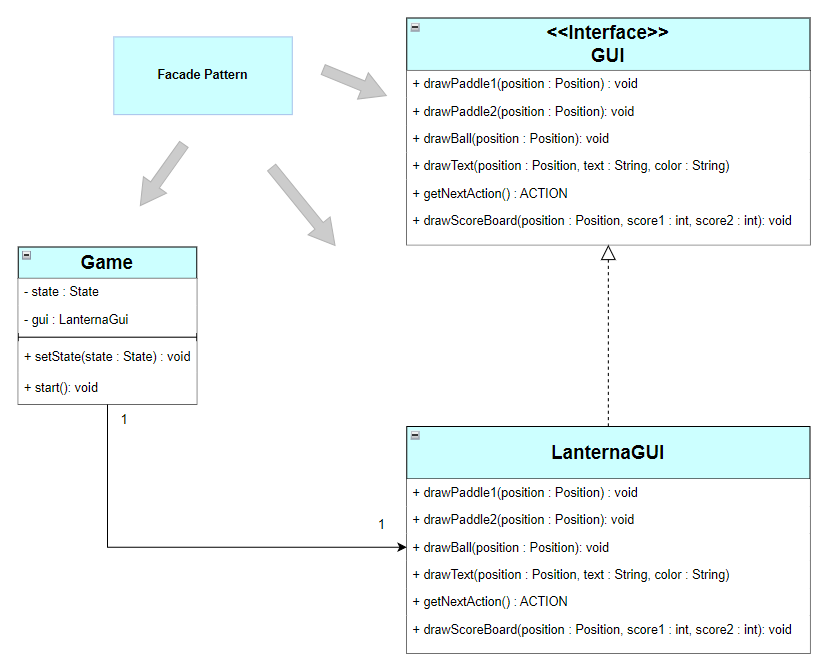

## LDTS_T14_G03 - PONG

## Description
For this project, our group decided to make a spin-off of the classic and revolutionary Pong, made by Atari in 1972.
We decided on this game because although it is simple, allowing us to focus on following good object-oriented design practices,
with close attention to the use of appropriate design patterns and complete testing, it also is different from previous projects and exercises we have done,
in the sense that we need to implement some features that were not formerly explored in our lectures, like the physics of the ball.

This project was developed by Afonso Domingues (up202207313@fe.up.pt), David Gonçalves (up202208795@fe.up.pt) and Tomás Marques (up202206667@fe.up.pt) for LDTS 2023-24.

## Implemented Features
- **Player vs. Player:** Engage in a head-to-head battle with a friend;
- **Connected Menus:** - Users can navigate throught various menus within the game, such as the Main Menu, Mode, Play and Winner;
- **Responsive Controls:** - Players may move their paddles up and down to hit the ball through keyboard inputs that are interpreted according to the current game state;
- **Collisions Dection:** - Collisions between the ball, walls and paddles are verified. The ball will bounce off the walls and paddles in a realistic way, in the direction you would expect.
- **Score Tracking:** - Keep track of the score for each player, the first to 11 wins.
- **Music and Sound Effects** - Integration of music and sound effects in Pong, enhancing the gaming experience, providing an immersive and engaging environment for players.
- **Use of Threads** - The use of threads is associated with the game flow. It prevents the game from running too fast or too slow on different systems. It separates the game logic from the GUI operations, allowing for smoother user interactions.

  

  <b><i>Fig 1. Main Menu</i></b>

  

  <b><i>Fig 2. Game dificulty selection</i></b>

  

  <b><i>Fig 3. Gameplay </i></b>

## Planned Features

All the planned features were successfully implemented.

## Design

### General Structure 
#### Problem in Context:
Our initial challenge  in developing the Pong game was determining its structure. 
Given that our game involves a graphical user interface (GUI) and is organized into different game states, 
we needed to identify suitable design patterns to meet our project requirements effectively.

### The Patterns used:
### Model-View-Controller
To structure our Pong game effectively, we incorporated the Model-View-Controller (MVC) pattern. 
This architectural pattern divides our project  into three integral components.
- #### Model
The model is dedicated to representing the data of the classes displayed in our Pong game.
- #### View
Responsibility for displaying data on the screen lies with the view. 
It also transmits user inputs to the controller for processing.
- #### Controller
Within the MVC pattern, the controller plays a crucial role. 
It modifies the data from the model based on user inputs received from the view.
### State Pattern
In our pong game, we implemented the State Pattern to manage various states, including Game, Menu, Winner, and Mode states.
This dynamic use of the State Pattern ensures seamless transitions between states, enhancing the overall user experience in our Pong game.
- #### Game State
The Game State governs the actual gameplay, handling interactions between paddles and the ball. 
During a match, the game transitions to this state.
- #### Menu State
Initiating the Pong game places it in the Menu State. 
From here, players can navigate through different options, such as starting a new game or adjusting settings.
- #### Winner State
Upon concluding a game, the Winner State appears, 
announcing the victorious player and providing options to play again or return to the menu.
- #### Mode State
The Mode State allows players to select the difficulty level before starting a new game. 
It offers options such as Easy, Medium, and Hard, influencing the gameplay experience.

### Implementation:
In the implementation phase, our Pong game exhibits a well-defined structure based on the Model-View-Controller (MVC) pattern. 
This design ensures clear separation of responsibilities among various classes:

  

  <b><i>Fig 1. Model-View-Controller pattern in Pong</i></b>

- #### Model Classes:
    These classes are dedicated to storing and managing data essential for the game, 
    upholding the principles of the Single Responsibility Principle (SRP).
- #### Controller Classes:
    Responsible for managing the game logic, 
    the controller classes ensure that the model is appropriately updated based on user inputs from the view.
- #### Viewer Classes: 
    Handling the visual effects on the screen, 
    viewer classes manage the display of data from the model and interact with the controller to convey user inputs.

Furthermore, our Pong game incorporates the State Pattern for managing different states seamlessly. 
Each state, including Game, Menu, Winner, and Mode, is implemented with a similar structure, 
allowing the game to alter its behavior efficiently based on the current state.

### Consequences
Embracing the State and MVC patterns in our design yields several noteworthy benefits:

- #### Explicit Representation of States:
    The use of the State Pattern makes various game states explicit in the code, 
    eliminating the reliance on a series of flags and contributing to a more organized structure.

- #### Single Responsibility Principle (SRP):
    The MVC pattern ensures that each class adheres to the SRP, promoting a well-organized and maintainable codebase.

- #### Ease of Feature Addition:
    The modular nature of the design makes it easy to introduce new features throughout the development stage, 
    enhancing the game's overall functionality and user experience.

### Dynamically determining the State

### Problem in Context:
Within the Pong game, different game states, such as GameState, MenuState, WinnerState, and ModeState, require specific Viewer and Controller objects. 
Instead of instantiating these objects directly in the State class, 
we adopt the Factory Method Pattern to delegate the responsibility of creating these objects to specialized factories.

### The Pattern:
The Factory Method Pattern is a creational design pattern that provides an interface for creating objects 
in a superclass but allows subclasses to alter the type of objects that will be created. 
In our implementation, each State class has its own factory responsible for creating the corresponding Viewer and Controller objects.

### Implementation:
In our Pong game, we embraced the Factory Method Pattern to efficiently manage different game states, 
each with its associated Viewer and Controller. For instance, the GameState class, responsible for handling the gameplay, 
extends the generic State class and implements the factory methods getViewer() and getController(). 
In the getViewer() method, an instance of the GameViewer is created, tailored to visualize the game-specific model. 
Similarly, the ArenaController is instantiated in the getController() method to handle user input and update the game state accordingly. 
This approach allows each state, be it the gameplay, menu, winner screen, or mode selection, to dynamically determine the appropriate Viewer and Controller without hardcoding them. 
The abstract State class acts as a template, ensuring a consistent structure across different game states while promoting encapsulation and flexibility in handling state-specific behavior.

  

  <b><i>Fig 5. State and Factory Method Pattern</i></b>

### Consequences:
Applying the Factory Method Pattern in the context of State classes and 
their associated Viewer and Controller objects provides the following benefits:

- #### Loose Coupling:
  The Factory Method Pattern ensures that the State class is not directly dependent on specific Viewer and Controller implementations, 
  promoting flexibility and maintainability.

- #### Open/Closed Principle:
  Introducing new game states or modifying existing ones can be done without changing the existing client code, 
  adhering to the Open/Closed Principle.

- #### Encapsulation:
  Each State class encapsulates the creation of its associated Viewer and Controller objects, 
  following the principle of encapsulation and single responsibility.

- #### Customization:
  Different states can have their own specific implementations of Viewer and Controller, allowing for customization and adaptability.

### GUI Simplification

### Problem in Context:
The Lanterna library presented unnecessary complexities for our Pong game GUI, requiring a more straightforward and streamlined interface. 
By isolating the GUI-related functionalities, we aimed to eliminate irrelevant features, adhere to the Interface Segregation Principle, 
and invert dependencies following the Dependency Inversion Principle.

### The Pattern:
To address these issues and ensure a more maintainable and flexible codebase, we adopted the Facade Pattern.

### Implementation:
The LanternaGUI class acts as a facade, providing a simplified interface to the complex subsystem of Lanterna. 
It encapsulates the details of Lanterna, allowing us to include only the features essential to our Pong game. 
The interface GUI defines the necessary methods, such as drawing paddles, balls, scoreboards, and handling user inputs.

  

  <b><i>Fig 5. Facade Pattern Design for GUI</i></b>

### Consequences:
The adoption of the Facade Pattern in our Pong game GUI design yields several benefits:

- #### Isolation of Complexity:
  The facade isolates our code from the intricacies of the Lanterna library, 
  promoting a cleaner and more readable implementation.

- #### Testability and Replaceability:
  The simplified interface enhances testability, and the facade allows for easy replacement of the underlying GUI subsystem without affecting the game logic.

- #### Respecting Principles:
  The pattern aligns with the Interface Segregation Principle by providing a tailored interface 
  and adheres to the Dependency Inversion Principle by decoupling the high-level module (game) from the low-level module (Lanterna).

This design ensures that our Pong game maintains a clear and concise GUI while accommodating future changes and enhancements.

### Game Loop Pattern for Continuous Game Progression

### Problem in Context:
Developing a dynamic and responsive gaming experience for our Pong game posed challenges in managing diverse game elements within a graphical interface. 
The need for a structured approach to handle paddles, the ball, and score updates while ensuring smooth transitions between states became evident. 

### The Pattern:
To address these challenges, we embraced the Game Loop Pattern, a fundamental architecture that forms the backbone of our game's continuous and fluid execution. 
This pattern enables systematic updates and rendering, ultimately delivering an engaging gaming experience to our users.

### Implementation:
The game's core functionality is driven by the Game Loop Pattern implemented in the "State" class. 
The step method, overridden in subclasses like "GameState" and "MenuState," orchestrates the game's progression. 
Within each iteration, the method retrieves user input, updates the game state through the controller, and visually renders changes using the viewer. 
This pattern ensures a continuous and uniform flow of game actions, contributing to a responsive and dynamic gaming experience.

  

  <b><i>Fig 5. Facade Pattern Design for GUI</i></b>

### Consequences:
The adoption of the Game Loop Pattern in our Pong game design yields several key advantages:

- #### Consistent Game Progression:
  The pattern ensures a continuous and consistent game flow, preventing sudden jumps or disruptions in gameplay.

- #### Real-Time Interaction:
  By continuously updating the game state, the pattern allows for real-time interaction with user inputs, 
  providing a responsive and immersive gaming experience.

- #### Modular and Extensible:
  The separation of concerns in the "State" class allows for easy modification and extension of game behaviors. 
  New states can be introduced seamlessly, enhancing the game's functionality.

This pattern forms the backbone of our game's mechanics, providing a robust structure that facilitates user interaction and maintains a dynamic gaming experience.

### Sound Management

### Problem in Context:
The challenge in our Pong game was to manage the playback of various sounds with a unified control system. 
To prevent conflicts and ensure consistent sound management, we needed a single point of access for music-related functionalities, 
avoiding the instantiation of multiple conflicting instances.

### The Pattern:
We employed the Singleton Pattern to address this challenge. By utilizing a private constructor and a static method for obtaining the instance, 
this pattern ensures that a class has only one instance and provides a global point of access to it.

### Implementation:
In the "MusicManager" class, the Singleton Pattern is implemented through the getInstance() method. 
This method checks if an instance already exists; if not, it creates one, ensuring that only a single instance of "MusicManager" exists throughout the application.

### Consequences:

- #### Global Access:
  The Singleton Pattern enables any part of the application to access the same instance of "MusicManager," 
  offering a unified interface for sound-related operations.

- #### Resource Efficiency:
  By restricting the creation of multiple instances, 
  the pattern optimizes resource usage and prevents unnecessary duplications.

- #### Centralized Control:
  The Singleton Pattern facilitates centralized control over sound-related functionalities, 
  promoting consistency and coherence in managing game sounds.

## Mockup

## UML Diagram

## Known-code Smells
We fixed all the errors reported by the error-prone. No other major code smells identified.

## Testing

### Screenshot of coverage report

### Link to mutation testing report

## Self-Evaluation

The team members efficiently divided tasks and contributed their expertise, 
leading to improved Java skills and a better understanding of key principles and design patterns.

- Afonso Domingues: 33,3%
- David Gonçalves: 33,3%
- Tomas Marques: 33,3%